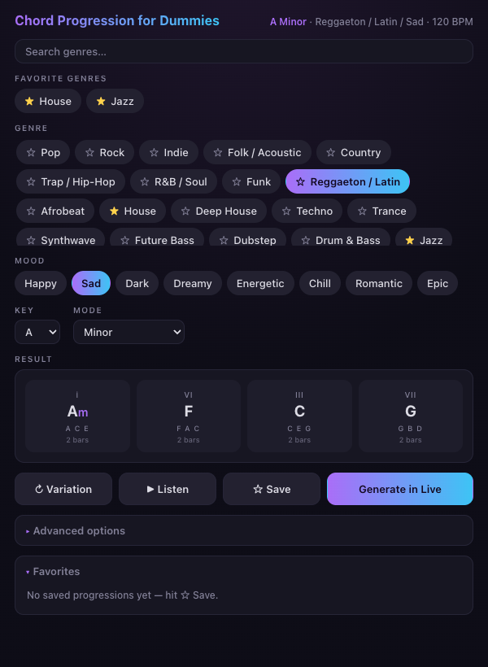

# Chord Progression for Dummies

An [Ableton Live 12](https://www.ableton.com/) extension (Extensions SDK `1.0.0-beta.0`)
that makes good chord progressions effortless: **pick a genre and a mood, get a
progression** — with all the rhythmic/dynamic "feel" chosen for you. Simpler and prettier
than its sibling [`chord-progression`](../chord-progression); the technical knobs are tucked
behind an **Advanced** button.

> **Status: implemented (v1.0.0).** Genre/mood engine, favorites, per-genre preview and the
> Advanced panel are built. Packaged `.ablx` is ready to install.



## What it does

- **Genre** — a big, searchable list (~24) with your favorites pinned on top.
- **Mood** — Happy, Sad, Dark, Dreamy, Energetic, Chill, Romantic, Epic.
- **Key + Mode** — simple pickers; mood drives the *feel*, key/mode drive the *harmony*.
- **Variation** — cycle fresh progressions for the same genre + mood.
- **Feel, automatic** — genre + mood set swing, gate, dynamics, density, octave and more.
  Power users open **Advanced** for the full v1 control set (+ best-effort ADSR).
- **Favorites** — star genres (pin them) and whole progressions (recall + re-generate),
  saved across sessions.
- **Listen** — in-browser preview with a per-genre tone (piano, EP, pad, pluck, synth).
- **Generate** — writes a MIDI clip into the right-clicked Session slot.

See the design docs:

- [docs/DECISIONS.md](docs/DECISIONS.md) — every settled choice.
- [docs/DESIGN.md](docs/DESIGN.md) — architecture, data model, UI.
- [docs/CONTENT-MODEL.md](docs/CONTENT-MODEL.md) — genres, moods, templates, feel.

## Usage

Right-click an empty **Session** clip slot → **Chord Progression for Dummies…**.

## Develop

**Requirements:** Node.js ≥ 24.14.1; Ableton Live 12 Beta with Developer Mode on. The SDK
and CLI are vendored in `vendor/` (Ableton beta software — not redistributable).

```bash
npm install
cp .env.example .env     # set EXTENSION_HOST_PATH to your Live beta
npm start                # build:dev + extensions-cli run
npm run build            # production bundle
npm run package          # build a .ablx
```

## Constraints honored

The SDK has no transport control or real-time MIDI, so the preview can't drive your own Live
plugin live (use Generate, then play in Live). Instrument ADSR is only reachable when the
device exposes named Attack/Decay/Sustain/Release parameters — handled best-effort in
Advanced. Full rationale in [docs/DECISIONS.md](docs/DECISIONS.md).

## License

Extension source: MIT. The bundled Ableton SDK/CLI have their own terms (Ableton beta).
